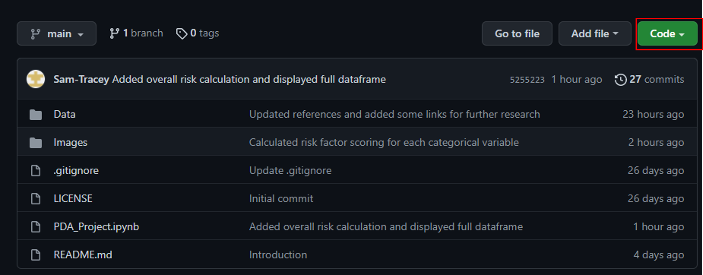
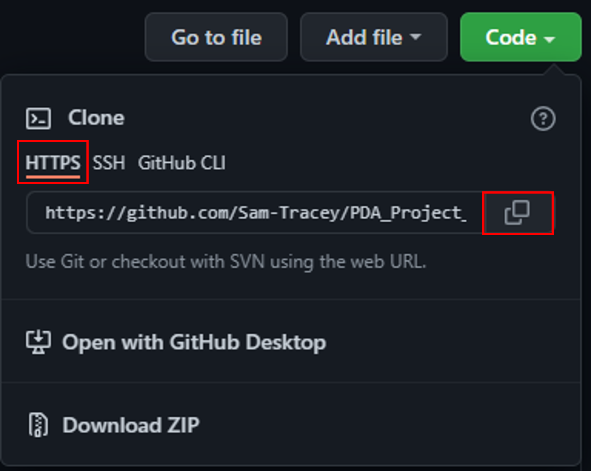
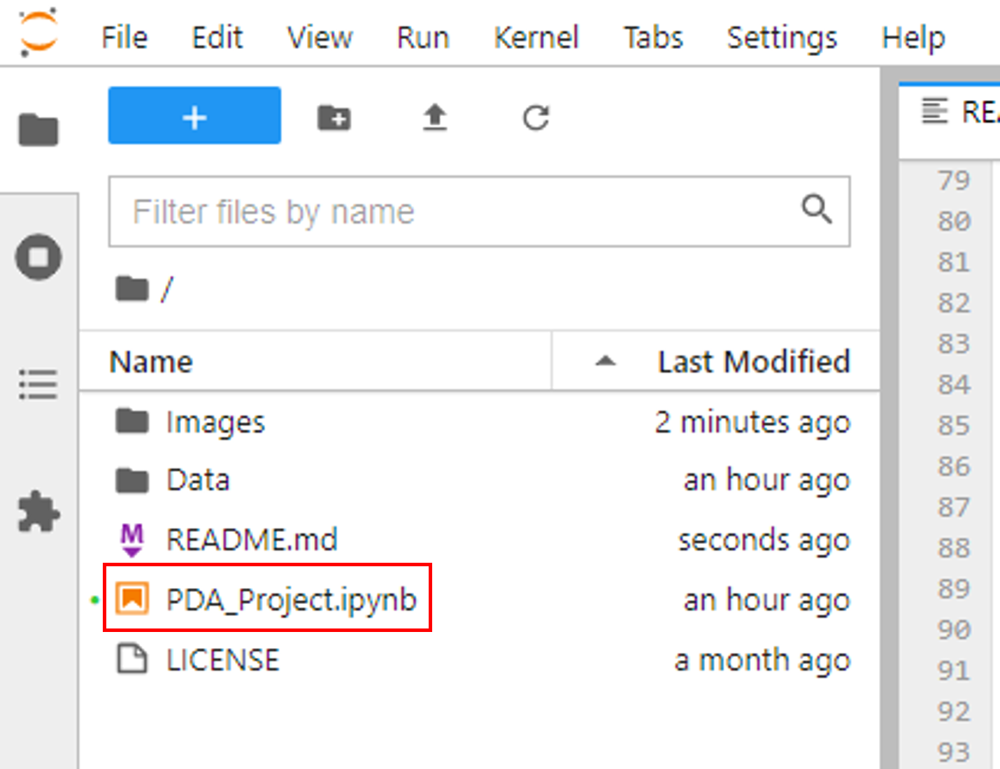
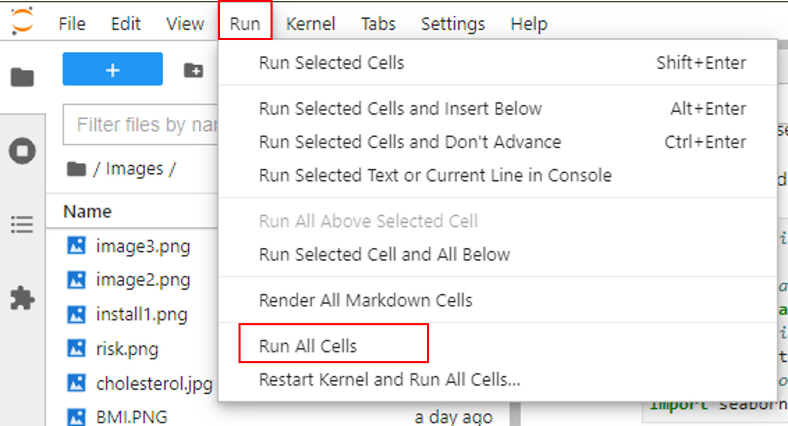

***

# PDA_Project_2021

***
## Name: Sam Tracey
## Student ID: G00398245
## Date: December 2021
## Programming For Data Analysis Project 2021 (GMIT)
***
 

## **Problem Statement**

For this project you must create a data set by simulating a real-world phenomenon of
your choosing. You may pick any phenomenon you wish – you might pick one that is
of interest to you in your personal or professional life. Then, rather than collect data
related to the phenomenon, you should model and synthesise such data using Python.
We suggest you use the numpy.random package for this purpose.
Specifically, in this project you should:
- Choose a real-world phenomenon that can be measured and for which you could collect at least one-hundred data points across at least four different variables.
- Investigate the types of variables involved, their likely distributions, and their relationships with each other.
- Synthesise/simulate a data set as closely matching their properties as possible.
- Detail your research and implement the simulation in a Jupyter notebook – the data set itself can simply be displayed in an output cell within the notebook.

***

## Introduction.

This repository contains a Jupyter Notebook and associated files demonstrating my Python programming for the module
"Programming For Data Analysis" 2021 using the following Python packages:

- <code>pandas</code> https://pandas.pydata.org/docs/
- <code>numpy</code> https://numpy.org/doc/
- <code>matplotlib.pyplot</code> https://matplotlib.org/stable/api/_as_gen/matplotlib.pyplot.html
- <code>seaborn</code> https://seaborn.pydata.org/

**I have decided to simulate a dataset based on the risk of Heart Disease in the Irish population.**

## Steps to Download This Repository.

1. Open your browser and paste the following into the address bar: https://github.com/Sam-Tracey/PDA_Project_2021
2. Above the list of files click the green Code button:

 

3. Click on HTTPS then the "copy" icon:

 
4. Open your preferred Command Line Linterface (CLI). During this project I used Cmder which can be downloaded at: https://cmder.net/
5. Navigate to the directory into which you wish to clone the repository e.g cd Users\yourname\Desktop
6. Type git clone and then the paste the URL you copied in step 3 above: <code>λ git clone https://github.com/Sam-Tracey/PDA_Project_2021.git</code>

 

## Installing Necessary Packages.

The notebook in this repository was created in Jupyter Lab which was included in the most recent (at the time of writing) version of Anaconda. I would strongly suggest 
updating your version of Anaconda at the following link: https://www.anaconda.com/products/individual#Downloads. This version of Anaconda contains all of the packages that are used
in this notebook.

## Running the Notebooks.

1. Open your Command Line Interface (CLI).
2. Navigate to the directory in which you cloned the repository.
3. In your CLI type: <code>jupyter lab</code>
4. A broswer window will open with Jupyter Lab Running.
5. In the left hand window you will see one .ipynb file:

 

6. Double click on the file to view the code.
7. In the Menu Bar select: Run > Run All Cells:

 

Please not, a static html version of this notebook has been stored at: https://mybinder.org/v2/gh/Sam-Tracey/PDA_Project_2021/c191ce4decba2830f1d42b66597d1b5e9843efd7?filepath=PDA_Project.ipynb

## Navigating the Notebook.

When you have successfully run all cells in the notebook simulated data and charts will be generated for each of the variables listed below:

- Age 
- Gender 
- Smoker
- High BP
- Diabetes
- Alcohol
- Inactivity
- BMI
- Hi Cholesterol
- Age_Range
- Age_Risk
- Smoker_Risk
- Cholesterol_Risk
- BP_Risk
- Diabetes_Risk
- Alcohol_Risk
- BMI_Risk
- Inactivity_Risk
- Overall_Risk

### Age and Gender.

The continuous variable age and categorical variable gender were simulated based on data obtained from the Census carried out in Ireland in 2016 available at: https://www.cso.ie/en/releasesandpublications/ep/p-cp3oy/cp3/assr/

### Smoker

The categorical variable Smoker signifies whether the person represented in our simulated data smokes or does not smoke. The data and probabilities used to create this simulated data set was obtained from the Health Service Executive Ireland and can be found here: https://www.hse.ie/eng/about/who/tobaccocontrol/research/smoking-in-ireland-2020.pdf

### High_BP, Diabetes, Alcohol, Inactivity, BMI, Hi Cholesterol.

The categorical risk factor variables associated with heart disease are based on data provided by the Health Executive Ireland in 2021 via their "Healthy Ireland Survey 2021 Summary Report". This report is based on responses obtained from 7454 Irish residents between October 2020 and March 2021. The simulated data for each of these variables are based on the survey responses obtained. A copy of the report is stored in this repository for easy access and an online version is available at: https://assets.gov.ie/206555/260f3b84-bf78-41a2-91d7-f14c7c03d99f.pdf

### Age_risk, Smoker_Risk, Cholesterol_Risk, BP_Risk, Diabetes_Risk.

These ordinal variables quantify the risk associated for heart disease that each factor carries. This data was based on "Charts for estimation of coronary heart disease (CHD) risk in men and women" found in the Global Risk of Coronary Heart Disease: Assessment and Application paper. A link to the paper and relevant tables can be found here: https://www.aafp.org/afp/2010/0801/p265.html

### Alcohol_Risk, BMI_Risk, Inactivity_Risk

These ordinal variables were extrapolated from various papers which detailed the risk ratio for each factor:
- Alcohol_Risk: https://www.ncbi.nlm.nih.gov/pmc/articles/PMC6527044/
- BMI_Risk: https://pubmed.ncbi.nlm.nih.gov/21116472/
- Inactivity_Risk: https://journals.sagepub.com/doi/full/10.1177/2047487320916823

### Overall_Risk

Overall risk is a calculated field based on the sum of all other risk factors.

***

## Note on Seeding.

This notebook does not use <code>np.random.seed</code> to force identical simulated data on each run of the notebook. Each time you run the notebook you will generate a different simulated dataset based on the probabilities defined for each variable.

## References.

All references are included in the last cell of the notebook.
